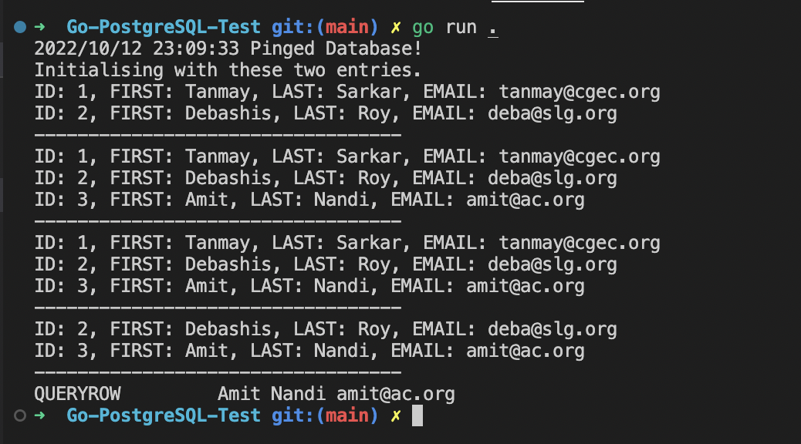

# Go-PostgreSQL-Test

**This is the first project where I learned connecting PostgreSQL to Golang.**
**Used [jackc/pgc](https://github.com/jackc/pgx) for connecting database**

**Running the program -**

